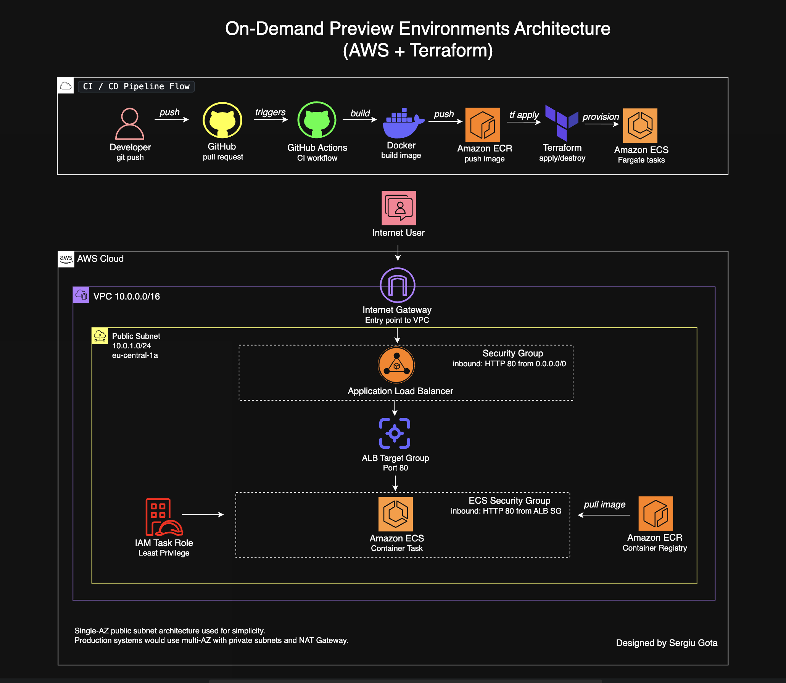
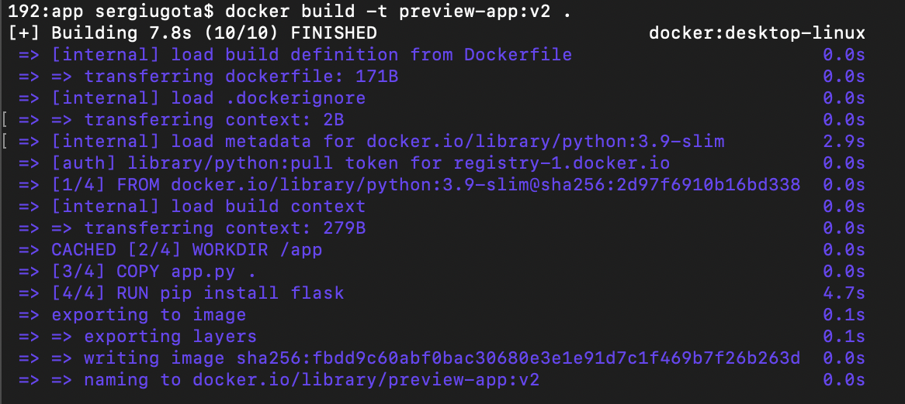
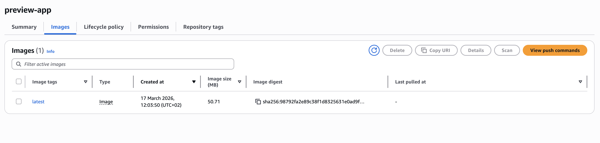
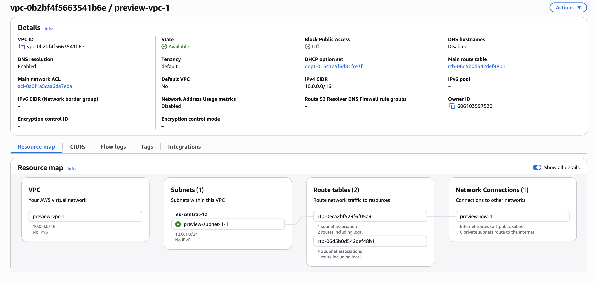
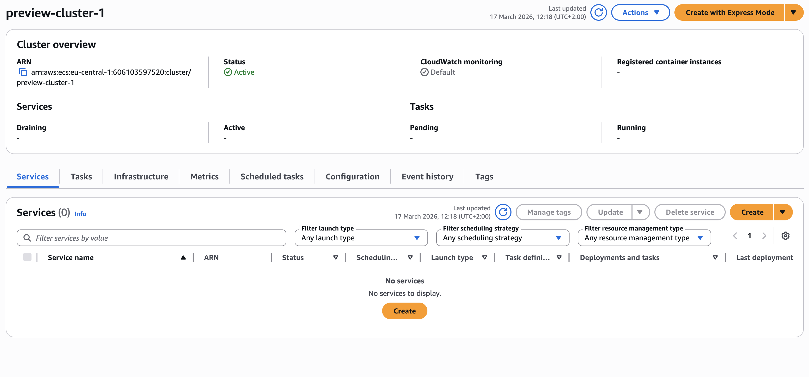
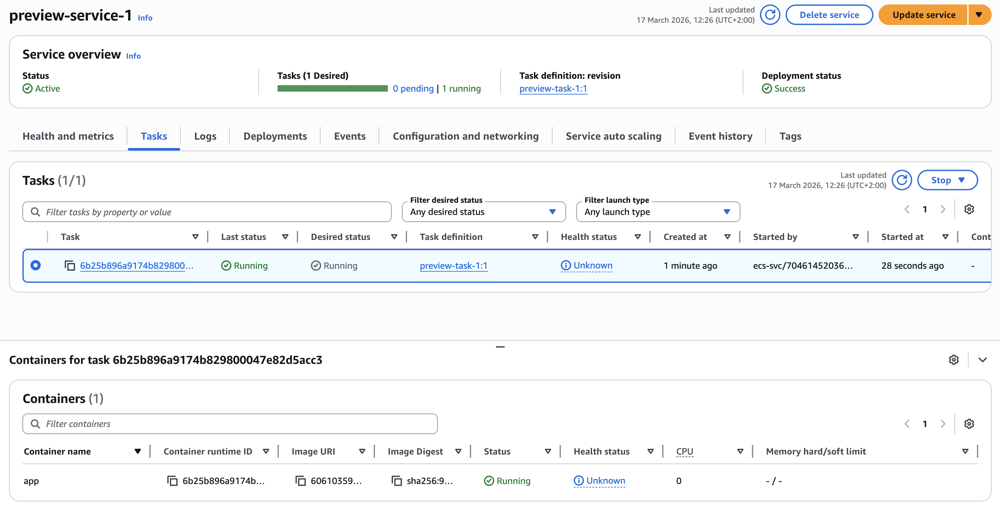
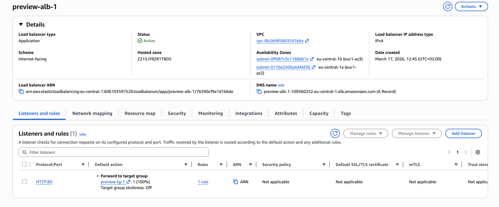
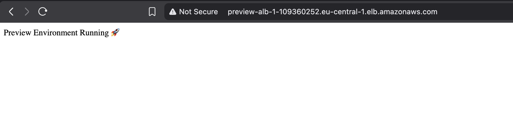
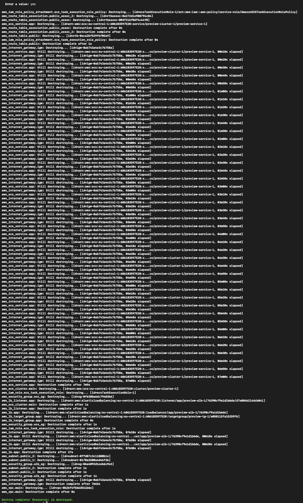

# Ephemeral Preview Environments on AWS

> Per-PR isolated infrastructure · Auto-provisioned by Terraform · Auto-destroyed on merge · GitHub Actions CI/CD

---

## This project implements ephemeral preview environments on AWS using Terraform and GitHub Actions.

## Each pull request automatically provisions an isolated environment where changes can be tested safely. Once the pull request is closed, the entire infrastructure is destroyed to optimize cost.

## This simulates a real-world CI/CD workflow used in modern engineering teams, where environments are short-lived and fully automated.

### Architecture



Each pull request automatically provisions a fully isolated AWS environment — its own VPC, ALB, ECS Fargate task, and security groups — provisioned in under 5 minutes via GitHub Actions and Terraform. When the PR is merged or closed, `terraform destroy` runs automatically and removes every resource, leaving zero idle infrastructure.

**Stack:** Terraform · GitHub Actions · AWS ECS Fargate · ECR · ALB · VPC · IAM · Docker

---

## CI/CD Pipeline Flow
```
git push → GitHub PR → GitHub Actions → Docker build → ECR push → Terraform apply → Live preview URL
                                                                                           ↓
                                                                          PR closed → Terraform destroy → No idle resources
```

---

## Engineering Decisions

**Why ephemeral environments instead of a shared staging environment?**
Shared staging environments create conflicts when multiple developers are testing simultaneously. A broken feature on shared staging blocks everyone. Per-PR environments are fully isolated — each developer gets their own stack, and merging one PR has zero effect on any other open PR.

**Why ECS Fargate over EC2?**
Fargate removes the need to manage, patch, or right-size EC2 instances. For short-lived environments that spin up and down per PR, Fargate is the correct choice — no capacity planning, no idle compute between PRs, no patching overhead.

**Why Terraform over console provisioning?**
Every resource is defined in code, version-controlled, and reproducible. `terraform apply` creates the environment in under 5 minutes. `terraform destroy` removes it completely. No manual steps, no configuration drift, no orphaned resources.

**Why a single public subnet architecture?**
This project is optimised for simplicity and cost as a preview environment. A production system would use private subnets for ECS tasks with a NAT Gateway for outbound traffic — documented in the Production Improvements section. The trade-off is intentional: preview environments prioritise speed and low cost over production-grade isolation.

**Why separate security groups for ALB and ECS?**
The ECS security group only accepts inbound traffic from the ALB security group — not from the internet directly. Even in a public subnet, the ECS task is never publicly reachable except through the load balancer. This is least-privilege at the network layer.

---

## Deployment Workflow

### When a PR is opened

| Step | Action |
|------|--------|
| 1 | GitHub Actions triggers on PR open event |
| 2 | Docker image built from application source |
| 3 | Image pushed to Amazon ECR |
| 4 | `terraform apply` provisions VPC, IGW, subnet, ALB, ECS cluster, ECS service, security groups, IAM roles |
| 5 | ECS task pulls image from ECR and starts container |
| 6 | ALB health check passes — preview URL becomes live |

**Result:** Fully isolated environment available in under 5 minutes, scoped to that specific PR.

### When a PR is closed or merged

| Step | Action |
|------|--------|
| 1 | GitHub Actions triggers on PR close event |
| 2 | `terraform destroy` runs against the PR environment |
| 3 | ECS service scales down, tasks terminate |
| 4 | ALB, VPC, subnets, IGW, security groups removed |
| 5 | Zero idle resources remain |

**Result:** Complete environment teardown. No cost accumulates between PRs.

---

## AWS Infrastructure
```
AWS Cloud
└── VPC  preview-vpc-1  10.0.0.0/16
    └── Availability Zone: eu-central-1a
        └── Public Subnet  preview-subnet-1-1  10.0.1.0/24
            ├── Internet Gateway  (entry point to VPC)
            ├── Application Load Balancer  [SG: inbound 0.0.0.0/0 :80]
            ├── ALB Target Group  (Port 80)
            ├── ECS Fargate Task  [SG: inbound from ALB SG only :80]
            └── IAM Task Role  (least-privilege — ECR pull + CloudWatch logs)

Amazon ECR  (regional managed service — ECS pulls image on task start)
```

**Route table:** `0.0.0.0/0 → preview-igw-1` · Local: `10.0.0.0/16`

---

## Technologies Used

| Category | Technology |
|----------|-----------|
| Cloud | AWS ECS Fargate, ECR, ALB, VPC, IAM |
| Infrastructure as Code | Terraform |
| CI/CD | GitHub Actions |
| Containerisation | Docker |
| Networking | VPC, Internet Gateway, Security Groups, Route Tables |

---

## Project Structure
```
ephemeral-preview-environments-aws
├── architecture/
│   └── diagram.png                  # AWS architecture diagram
├── app/
│   ├── Dockerfile                   # Application container
│   └── index.html                   # Application source
├── infrastructure/
│   ├── main.tf                      # ECS, ALB, VPC resources
│   ├── variables.tf
│   └── outputs.tf                   # ALB DNS (preview URL)
├── .github/
│   └── workflows/
│       └── deploy.yml               # PR open → apply · PR close → destroy
└── README.md
```

---

## Screenshots

### Docker Build


### ECR — Image Pushed


### Terraform Apply — VPC and Networking Created


### ECS Cluster Running


### ECS Service Running


### Application Load Balancer Active


### Live Preview Environment


### Terraform Destroy — Clean Teardown


---

## Challenges & How I Solved Them

**ECS tasks failing to start**
Cause: container port in the task definition did not match the ALB target group port. ECS was running the container on port 3000 while the target group expected port 80.
Fix: aligned container port mapping in the task definition with the target group port configuration. Health checks then passed immediately.

**Application not reachable via ALB DNS**
Cause: the ECS security group was blocking all inbound traffic — no rule existed for port 80.
Fix: added an inbound rule to the ECS security group allowing port 80 from the ALB security group only, not from the internet directly. This also improved the security posture.

**Terraform destroy hanging**
Cause: ECS service dependencies prevented immediate deletion. Terraform tried to remove the ALB before ECS tasks had terminated.
Fix: added explicit `depends_on` ordering in Terraform to enforce correct destroy sequence — ECS service scales to 0 before ALB deletion is attempted.

**ECR image not found on deploy**
Cause: the image URI in the ECS task definition referenced the wrong ECR repository tag.
Fix: used Terraform output variables to pass the exact ECR image URI into the task definition dynamically, eliminating manual URI references entirely.

---

## Failure Scenarios and System Behaviour

| Scenario | What happens | Recovery |
|----------|-------------|----------|
| ECS task crashes | ECS attempts automatic restart · ALB health check fails · no traffic routed to unhealthy task | Automatic — ECS replaces task |
| ALB health check misconfigured | All targets marked unhealthy · no traffic routed | Fix health check path/port in task definition |
| ECR image missing | ECS task fails to start · deployment fails | Ensure image push completes before `terraform apply` |
| `terraform destroy` delays | ECS scales down before networking removed — takes 2–4 minutes | Expected behaviour — AWS dependency ordering |
| GitHub Actions failure | No infrastructure created · no preview URL | Check workflow logs and IAM permissions |

---

## Key Engineering Takeaways

- **Infrastructure should be treated as temporary.** If you can't destroy it cleanly and recreate it identically, it isn't production-ready.
- **Automation removes human error.** Every manual step in a deployment is a potential failure point. This project has zero manual steps from PR open to live environment.
- **Security groups enforce least privilege at the network layer.** ECS tasks are never directly exposed to the internet — all traffic routes through the ALB.
- **Observability must be designed in from the start.** ALB health checks and ECS task status provide visibility at every layer without additional instrumentation.
- **Cost and architecture are inseparable.** Ephemeral environments cost nothing when idle. The destroy step is as important as the apply step.

---

## Production Improvements

This project uses a single-AZ public subnet architecture optimised for simplicity as a preview environment. A production system would include:

- **Private subnets** for ECS tasks with a NAT Gateway for outbound traffic
- **Multi-AZ deployment** with ALB spanning two availability zones
- **HTTPS** via ACM certificate and Route 53 custom domain
- **Secrets Manager** for application secrets rather than environment variables
- **ECS Service Auto Scaling** based on CPU and memory thresholds
- **CloudWatch dashboards and SNS alarms** for operational monitoring

---

## Author

**Sergiu Gota**
AWS Certified Solutions Architect – Associate · AWS Cloud Practitioner    
[github.com/sergiugotacloud](https://github.com/sergiugotacloud) · [linkedin.com/in/sergiu-gota-cloud](https://linkedin.com/in/sergiu-gota-cloud)
